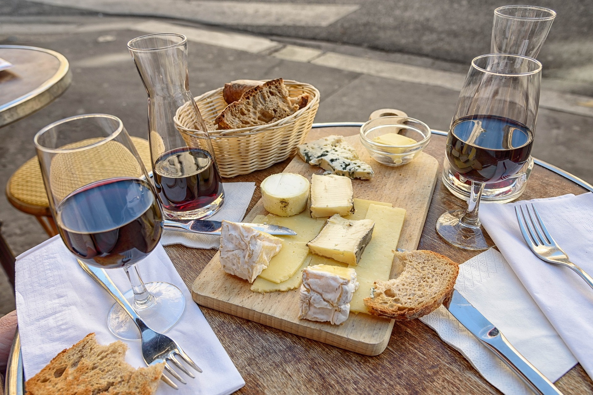

# jobethmuncy.github.io
<!DOCTYPE html>
<html lang="en">
    <head>
        <meta charset="utf-8" />
        <meta name="viewport" content="width=device-width, initial-scale=1, shrink-to-fit=no" />
        <meta name="description" content="" />
        <meta name="author" content="" />
        <title>Jobeth Muncy</title>
        <link rel="icon" type="image/x-icon" href="assets/img/favicon.ico" />
        <!-- Font Awesome icons (free version)-->
        
        <!-- Google fonts-->
        <link href="https://fonts.googleapis.com/css?family=Saira+Extra+Condensed:500,700" rel="stylesheet" type="text/css" />
        <link href="https://fonts.googleapis.com/css?family=Muli:400,400i,800,800i" rel="stylesheet" type="text/css" />
        <!-- Core theme CSS (includes Bootstrap)-->
        <link href="css/styles.css" rel="stylesheet"/>
    </head>
    <body id="page-top">
        <!-- Navigation-->
        <nav class="navbar navbar-expand-lg navbar-dark bg-primary fixed-top" id="sideNav">
            <a class="navbar-brand js-scroll-trigger" href="#page-top"
                >Jobeth Muncy</a
            ><button class="navbar-toggler" type="button" data-toggle="collapse" data-target="#navbarSupportedContent" aria-controls="navbarSupportedContent" aria-expanded="false" aria-label="Toggle navigation"></button>
            

                <ul class="navbar-nav">
                    <li class="nav-item"><a class="nav-link js-scroll-trigger" href="#about">About</a></li>
                    <li class="nav-item"><a class="nav-link js-scroll-trigger" href="#experience">Experience</a></li>
                    <li class="nav-item"><a class="nav-link js-scroll-trigger" href="#education">Education</a></li>
                    <li class="nav-item"><a class="nav-link js-scroll-trigger" href="#skills">Skills</a></li>
                    <li class="nav-item"><a class="nav-link js-scroll-trigger" href="#projects">Projects</a></li>
                    <li class="nav-item"><a class="nav-link js-scroll-trigger" href="#interests">Interests</a></li>
                    <li class="nav-item"><a class="nav-link js-scroll-trigger" href="https://docs.google.com/document/d/1xdgCbaDGUQUxEhtAyfz0c8tuwd2LOz5UC9SdU8svW5o/edit?usp=sharing">Resume</a></li>
                </ul>
            

        </nav>
        <!-- Page Content-->
        

            <!-- About-->
            <section class="resume-section" id="about">
                

                    <h1 class="mb-0">Jobeth Muncy</h1>
                    
Washington, DC · (719) 684-5660 · <a href="mailto:jobethmuncy@gmail.com">jobethmuncy@gmail.com</a>

                    
Mountain girl at heart, always seeking a new adventure. A career working with people has given me an in-depth human intuition that allows me to  adapt and understand new environments. I thrive on finding new ways to bring out the best skills in those around me. A natural curiosity and a logical mindset enables me to solve complex data challenges with a thoughtful approach .

                    

                        <a class="social-icon" href="https://www.linkedin.com/in/jobethmuncy/"><i class="fab fa-linkedin-in"></i></a>
                        <a class="social-icon" href="https://github.com/jobethmuncy"><i class="fab fa-github"></i></a>
                        <a class="social-icon" href="https://medium.com/@jobethmuncy"><i class="fab fa-medium"></i></a>
                    

                

            </section>
            

            <!-- Experience-->
            <section class="resume-section" id="experience">
                

                    <h2 class="mb-5">Experience</h2>
                    

                        

                            <h3 class="mb-0">Data Scientist | Data Engineer</h3>
                            
General Assembly

                            
*Created a classification model to sort text from Reddit comments to determine which category they fit into: wine or cocktail. Used an API to compile 100K comments for two different subreddit discussions. Applied Natural Language Processing techniques to remove 43% of the original content leaving only meaningful words. Trained and tested a Naive Bayes model that correctly classified 87% of comment segments.
                                 *Collaborated FEMA and New Light Technologies to take over 63K scientific articles about coronaviruses and created an application that allowed the user to find articles for their research with a direct link to the paper. Used the Gensim library to sort the articles by topic and key words.  
                                 *Created a wine recommender allowing the user in input any words about flavor, region, or style and returning similar wines. Wines were pulled from four different vendors with direct links attached to the recommended wines allowing the user to buy the wine and see what other wines the site recommended.

                        

                        
March 2020 - June 2020

                    

                    

                        

                            <h3 class="mb-0">Bartender/Seriver</h3>
                            
Tail Up Goat

                            
*Utilized communication and deduction to guide and enhance dining experiences at a Michelin starred restaurant. Executed flawless service adding personal and thoughtful touches throughout the meal resulting in an increased retention of repeat customers. 
                                 *Curated unique dining experiences for guests with custom beverage recommendations based on expert knowledge of cocktails, beers and wine. 
                                 *Responded to late or unannounced guest arrivals, dietary restrictions or aversions, kitchen and  bar delays with an immediate action plan. Pivoted the situation to be unnoticed by the guest and creating a positive outcome leaving them with an uninterrupted,  magical experience.

                        

                        
August 2016 - March 2020

                    

            </section>
            

            <!-- Education-->
            <section class="resume-section" id="education">
                

                    <h2 class="mb-5">Education</h2>
                    

                        

                            <h3 class="mb-0">General Assembly</h3>
                            

                            
Completed a 500+ hour immersive program developing skills in Python, Scikit-learn, SQL, NLP with extensive use of the Gensim library, web scraping, data cleaning and analysis, Machine Learning, Scala, Spark, and Neural Networks.  Emphasised both statistical analysis and client facing interpretability of data findings.

                        

                        
August 2006 - May 2010

                    

            </section>
            

            <!-- Skills-->
             <section class="resume-section" id="skills">
                

                    <h2 class="mb-5">Skills</h2>
                    
Programming Languages & Tools

                    <ul class="fa-ul mb-0">
                        <li><i class="fas fa-check"></i>Python</li>
                        <li><i class="fas fa-check"></i>Pandas</li>
                        <li><i class="fas fa-check"></i>Numpy</li>
                        <li><i class="fas fa-check"></i>SQL</li>
                        <li><i class="fas fa-check"></i>Spark</li>
                        <li><i class="fas fa-check"></i>Scala</li>
                        <li><i class="fas fa-check"></i>Data Visualization</li>
                        <li><i class="fas fa-check"></i>Machine Learning</li>
                        <li><i class="fas fa-check"></i>Natural Language Processing (NLP)</li>
                        <li><i class="fas fa-check"></i>Gensim</li>
                        <li><i class="fas fa-check"></i>Webscraping</li>
                    </ul>
                

            </section>
             <!-- Projects-->
             <section class="resume-section" id="projects">
                

                    <h2 class="mb-5">Projects</h2>
                    

                        

                            <h3 class="mb-0">Pick me a Wine!</h3> 
                    
                            
            
                            
The world of wine can be confusing to navigate. Every country has different 
                                rules and regulations for labeling and selling wines. A wine label itself 
                                can be difficult to read. If someone knows one or two words about a flavor profile, 
                                producer, grape, vineyard site, region, appellation how do they find that wine or 
                                other similar ones? I created a wine recommender that will take text and recommend 
                                wines that are available to purchase with a link to the site so they can buy and explore. 
                                I scraped 12,000 wines from Astor Wines, Chambers Street, Twenty Twenty Wines, and Wine.com to 
                                give a broad selection of wine for the user to pick from. Gensim FastText was utilized to take
                                user input and find words that are the most similiar to the segment and return wines that match 
                                the description. Direct links to selected wine is provided and each site has their own "similar wines" 
                                function to continue expanding user selection.  To see this project, 
                                <a href="https://git.generalassemb.ly/jobethmuncy/Submissions/tree/master/Capstone" target="_blank"><strong>click here</strong></a>
                            
 
                            <h3 class="mb-0">Indexing and Outbreak</h3> 

                            

                            
COVID-19 brought the world to a stand still. To aid in the race for a vaccine and better understanding of the virus, 
                                the Semantic Scholar team at the Allen Institute for AI created CORD-19, the COVID Open Research Dataset, in partnership
                                with Georgetown University, Microsoft Research, Amazon Web Services, the Chan Zuckerberg Initiative, the National 
                                Institutes of Health, and the White House created a database of over 63,000 scientific papers regarding coronaviruses
                                and other similar outbreaks from 1957 to today. 
                                How would a researcher find what they are looking for quickly with so much data? In collaberation with FEMA, Clay Carson, 
                                and Cynthia Chiang, we utilized both Doc2Vec and LDA within the Gensim library to search by keyword or topic. This is 
                                intened to expidite the research process in the race for a vaccine.  
                                To see this project, 
                                <a href="https://github.com/jobethmuncy/NLT" target="_blank"><strong>click here</strong></a>
                            
 
                            
                            <h3 class="mb-0">What are they talking about? Cocktails or Wine?</h3> 

                            
                            
I collected 100,000 comments using webscraping and the reddit API from both the cocktail and wine subreddit categories. 
                                The text was cleaned by removing HTML, non-letters, all words lowercased and tokenized, stopwords removed, and lemmatized. Then 
                                all words were turned into numerical values using CountVectorizer and TFIDF. Several classification models were trained to best classify unseen
                                text into the appropriate subreddit category. At the end of the day, the combination of CountVectorizer and Naive Bayes Classifer
                                was the best combination at 86% accuracy. As a fun experiment on the model, I had friends submit text to me about wine or cocktails 
                                and the model correctly classified 14 of 15 lines of text. 
                                 
                                To see this project, 
                                <a href="https://git.generalassemb.ly/jobethmuncy/Submissions/tree/master/Projects/project_3-master" target="_blank"><strong>click here</strong></a>
                            
 

                        

                        <!-- 
August 2006 - May 2010

                    
 -->
            </section>
            

            <!-- Interests-->
            <section class="resume-section" id="interests">
                

                    <h2 class="mb-5">Interests</h2>
                    
A Colorado native, my passions are exploring the wilderness, hiking to new mountaintops, finding a remote alpine lakes, and chasing marmots at high elevation.

                    
From my past career in restaurants, I love experiencing the creativity of chefs, vintners, and bartenders. I spend vacations seeking out historical bars or favorite vineyards. I collect cookbooks from my favorite meals for at home attemts at their magical bites.

                

            </section>

        <!-- Bootstrap core JS-->
        
        
        <!-- Third party plugin JS-->
        
        <!-- Core theme JS-->
        
    </body>
</html>
